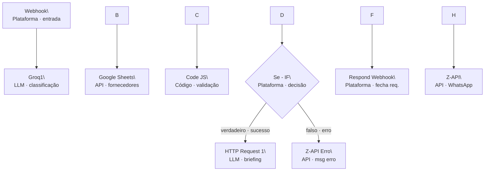

AI Workflow Compras
Workflow de automação de compras via WhatsApp, construído com n8n, Groq (LLaMA 3.3) e Google Sheets. O usuário envia o nome de um material pelo WhatsApp e recebe um briefing estruturado com fornecedores, preços de referência, prazo e recomendação de compra.
---
Arquitetura do Fluxo

---
Stack
Ferramenta	Função
n8n Cloud	Orquestração do fluxo
Groq (LLaMA 3.3 70B)	Classificação do material e geração do briefing
Google Sheets	Base de fornecedores
Z-API	Canal WhatsApp Business
---
Como Funciona
Usuário envia mensagem pelo WhatsApp (ex: `areia`)
Groq1 classifica o material e a categoria (`Agregados`)
Google Sheets retorna todos os fornecedores cadastrados
Code JS valida se o material existe na base e monta o payload
IF decide o caminho: briefing ou mensagem de erro
Groq2 gera o briefing estruturado com recomendação
Z-API entrega a resposta no WhatsApp
Cenários cobertos:
Material válido na base → briefing com fornecedores e recomendação
Material não cadastrado → mensagem de erro orientada
Mensagem sem contexto de compra → instrução para reformular o pedido
---
Estrutura do Repositório
```
ai-workflow-compras/
├── README.md
└── fluxo/
    └── Fluxo\_Compras\_Popware\_v4.json
```
---
Como Usar
Pré-requisitos
Conta n8n (Cloud ou self-hosted)
Chave de API Groq — console.groq.com
Google Sheets com a base de fornecedores
Instância Z-API ativa com número WhatsApp Business conectado
Importar o Fluxo
No n8n → menu `...` → Importar
Seleciona `fluxo/Fluxo\_Compras\_Popware\_v4.json`
Reconecta as credenciais: Google Sheets OAuth2, Groq API Key
No nó Google Sheets: aponta para o documento e aba corretos
No nó Z-API: insere o token e o número da instância
Ativa o toggle Sempre exibir dados no nó Google Sheets → Configurações
Publica o fluxo
Estrutura da Planilha de Fornecedores
A planilha deve conter as colunas abaixo (com espaço no final do nome, conforme exportação padrão do Sheets):
Fornecedor	Categoria	Material	Preço_ref	Prazo_dias	Disponibilidade	Homologado
D'fagundes	Agregados	Areia	120	2	Alta	Sim
Disavel	Ferramenta	Disco	45	1	Alta	Sim
---
Observações
O fluxo foi desenvolvido como MVP de portfólio com 3 materiais cadastrados (Areia, Disco, Fio)
A base de fornecedores pode ser expandida sem alterar o fluxo — basta adicionar linhas na planilha e incluir os novos materiais no prompt do Groq1
Para produção permanente: hospedar o n8n no Render (plano gratuito suporta o fluxo com limitação de sleep após inatividade)
---
Autor
Marcelo Tiozo Silva — github.com/MarceloTiozoSilva
Projeto desenvolvido como parte do portfólio Popware — automação e IA aplicada a processos de negócio.
