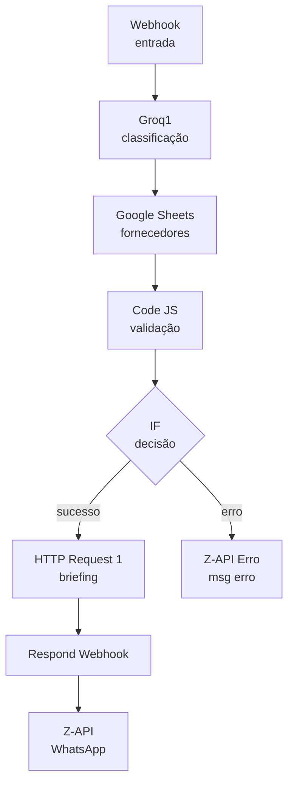

# AI Workflow Compras

Automação de compras via WhatsApp utilizando n8n, Groq (LLaMA 3.3) e Google Sheets.

O usuário envia o nome de um material pelo WhatsApp e recebe um briefing estruturado com fornecedores disponíveis, preços de referência, prazo de entrega e recomendação de compra.

---

## Arquitetura do Fluxo



---

## Stack

| Ferramenta | Função |
|---|---|
| n8n Cloud | Orquestração do fluxo |
| Groq — LLaMA 3.3 70B | Classificação do material e geração do briefing |
| Google Sheets | Base de fornecedores |
| Z-API | Canal WhatsApp Business |

---

## Como Funciona

1. Usuário envia mensagem pelo WhatsApp — ex: `areia`
2. Groq1 classifica o material e retorna a categoria — ex: `Agregados`
3. Google Sheets retorna todos os fornecedores cadastrados
4. Code JS valida se o material existe na base e monta o payload
5. IF decide o caminho: briefing ou mensagem de erro
6. Groq2 gera o briefing estruturado com recomendação
7. Z-API entrega a resposta no WhatsApp

**Cenários cobertos:**

- Material válido na base → briefing com fornecedores e recomendação
- Material não cadastrado → mensagem de erro orientada
- Mensagem sem contexto de compra → instrução para reformular o pedido

---

## Estrutura do Repositório

```
ai-workflow-compras/
├── README.md
└── fluxo/
    └── Fluxo_Compras_final.json
```

---

## Como Usar

### Pré-requisitos

- Conta n8n (Cloud ou self-hosted)
- Chave de API Groq — [console.groq.com](https://console.groq.com)
- Google Sheets com a base de fornecedores
- Instância Z-API ativa com número WhatsApp Business conectado

### Importar o Fluxo

1. No n8n → menu `...` → **Importar**
2. Seleciona `fluxo/Fluxo_Compras_final.json`
3. Reconecta as credenciais: Google Sheets OAuth2 e Groq API Key
4. No nó Google Sheets: aponta para o documento e aba corretos
5. No nó Z-API: insere o token e o número da instância
6. Ativa o toggle **Sempre exibir dados** em Configurações do nó Google Sheets
7. Publica o fluxo

### Estrutura da Planilha de Fornecedores

| Fornecedor | Categoria | Material | Preço_ref | Prazo_dias | Disponibilidade | Homologado |
|---|---|---|---|---|---|---|
| D'fagundes | Agregados | Areia | 120 | 2 | Alta | Sim |
| Disavel | Ferramenta | Disco | 45 | 1 | Alta | Sim |

---

## Observações

- MVP com 3 materiais cadastrados: Areia, Disco, Fio
- Para expandir: adicionar linhas na planilha e incluir os novos materiais no prompt do Groq1
- Para produção permanente: hospedar o n8n no Render (plano gratuito disponível)

---

## Autor

**Marcelo Tiozo Silva** — [github.com/MarceloTiozoSilva](https://github.com/MarceloTiozoSilva)
